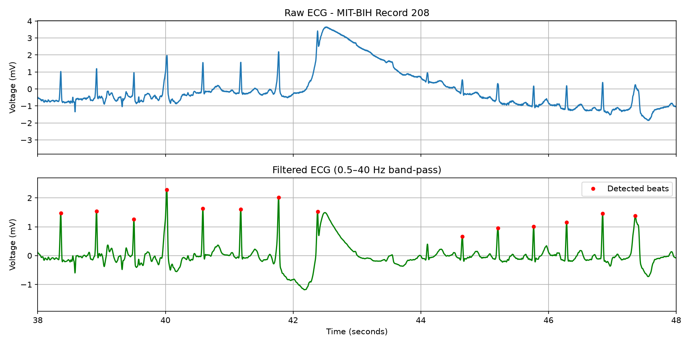
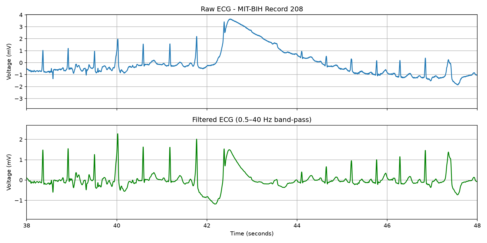
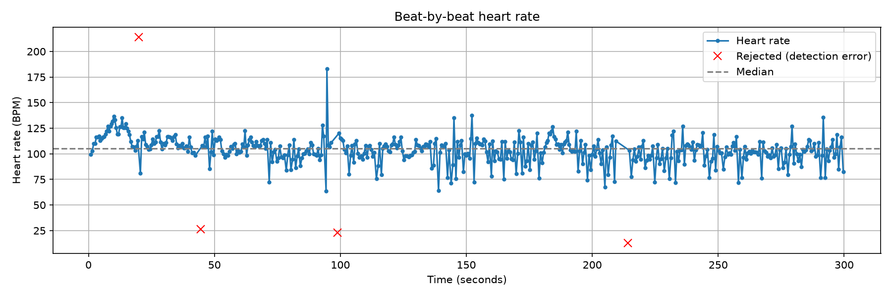

# ECG Heartbeat & Heart Rate Detector

A Python script that takes a real ECG recording, cleans out the noise, finds every heartbeat and calculates heart rate beat by beat.

This is my first coding project, built while learning Python as a first-year Biomedical Engineering student at SRMIST.



## What it does

1. **Loads a real ECG.** 5 minutes of record 208 from the [MIT-BIH Arrhythmia Database](https://physionet.org/content/mitdb/) (PhysioNet), sampled at 360 Hz.
2. **Cleans the signal.** A 0.5–40 Hz band-pass Butterworth filter removes slow baseline drift from breathing and fast jitter from muscle and electrical noise. It runs forward and backward (`filtfilt`) so the heartbeats stay at their true times.
3. **Detects heartbeats.** Finds R-peaks with `scipy.signal.find_peaks`: peaks taller than 0.5 mV and at least 0.25 s apart.
4. **Calculates heart rate.** Measures the RR interval (time between beats) and converts it to BPM with `60 / RR`.
5. **Rejects impossible values.** Heart rates outside 40–200 BPM are flagged as detection errors.
6. **Saves the results.** Plots, plus a beat-by-beat log (`heart_rate_log.csv`) that opens in Excel.

## Results

| Measure | Value |
|---|---|
| Heartbeats detected | 500 in 5 minutes |
| Median heart rate | **105.4 BPM**, above the normal resting range of 60–100 (tachycardia) |
| Range (after rejecting errors) | 63.7 – 183.1 BPM |
| Values rejected as detection errors | 4 |

### Before and after filtering
The raw signal (top) has a large artifact around 42.5 s where it jumps to +3.6 mV, probably caused by an electrode moving. The filter (bottom) removes the drift and shrinks the artifact.



### Heart rate over time
Each dot is one heartbeat. The red crosses are values the script rejected because they are not physically realistic.



## What I found

- **The extreme voltages were noise, not heartbeats.** I first guessed that the highest and lowest readings (3.65 mV and −3.49 mV) were abnormal beats. Plotting showed they were artifacts: a baseline jump at ~42.5 s and a noise burst at ~99 s.
- **Some beats are wider than others.** Around 101 s and 102.7 s there are beats with a wider, rounder QRS complex. These look like PVCs (premature ventricular contractions), which record 208 is known for.
- **Detector errors show up as impossible heart rates.** The 4 rejected values (13–26 BPM and 214 BPM) line up with the noisy sections, where a real beat was missed or noise was counted as an extra beat.

## Limitations

- The fixed 0.5 mV threshold misses small beats. One is missed at ~44.1 s, for example.
- Noise in the same frequency range as the heartbeat (0.5–40 Hz) can't be removed by filtering.
- It has only been tested on one recording.
- This is a learning project, **not a medical device**.

## How to run it

```bash
git clone https://github.com/adhavan516/ecg-heart-rate-detector.git
cd ecg-heart-rate-detector
python -m venv .venv
.venv\Scripts\activate
pip install -r requirements.txt
python ecg_detector.py
```

The first run downloads the ECG sample automatically, so it needs internet.

## Built with

Python · NumPy · SciPy · pandas · Matplotlib

## What I learned

- Setting up a Python project with a virtual environment, `requirements.txt` and `.gitignore`
- Why sampling rate and units matter: every calculation depends on them
- How band-pass filtering separates a signal from noise by frequency
- Peak detection, and the trade-off between missing beats and catching false ones
- Reading Python errors (`SyntaxError`, `NameError`) and fixing them
- Checking results against what is physically possible

## Ideas for next time

- Test on more patients from PhysioNet and compare against the database's own beat labels
- Use the Pan-Tompkins algorithm, a classic QRS detection method, instead of a fixed threshold
- Automatically flag wide beats as possible PVCs
